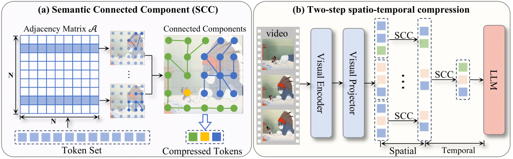

<div align="center">
<h2>LLaVA-Scissor: Token Compression with Semantic Connected Components for Video LLMs</h2>

[**Boyuan Sun**](https://bbbbchan.github.io)<sup>1,2*</sup> · [**Jiaxing Zhao**](https://scholar.google.com/citations?user=nVqvPAgAAAAJ)<sup>2*</sup> · [**Xihan Wei**](https://www.zhihu.com/people/HannahW)<sup>2</sup> · [**Qibin Hou**](https://houqb.github.io/)<sup>1&dagger;</sup>

<sup>1</sup>VCIP, Nankai University&emsp;&emsp;&emsp;&emsp;<sup>2</sup>Tongyi Lab, Alibaba Group&emsp;&emsp;&emsp;&emsp;

*Equal contribution &emsp;&dagger;Corresponding author

<a href="https://arxiv.org/abs/2506.21862"></a>
<a href='https://huggingface.co/BBBBCHAN/LLaVA-Scissor-baseline-7B'></a>
<a href='https://huggingface.co/BBBBCHAN/LLaVA-Scissor-baseline-0.5B'></a>
<a href='https://huggingface.co/papers/2506.21862'></a>
</div>


# News
* **2025-07-01:** 🚀 LLaVA-Scissor was ranked **#2 Paper of the Day** on [HuggingFace Daily Papers](https://huggingface.co/papers/date/2025-06-30).
* **2025-06-30:** 🔥  The code of [LLaVA Scissor](https://github.com/HumanMLLM/LLaVA-Scissor) is released.
* **2025-06-30:** 🔥  The paper of [LLaVA Scissor](https://arxiv.org/abs/2506.21862) is released. 


## Overview
LLaVA-Scissor provides a solution for compressing video tokens based on identifying semantic connected components.



Previous methods mostly attempt to compress tokens based on attention scores, but fail to achieve complete semantic coverage and tend to repeatedly select similar semantic regions. To address this, we propose a novel method termed Semantic Connected Components (SCC), which identifies semantically coherent groups of tokens to represent distinct, non-overlapping semantic regions across the video. SCC does not rely on positional adjacency, enabling it to capture global semantic relationships across the entire token sequence.

Building upon SCC, we propose LLaVA-Scissor, a two-step spatio-temporal token compression strategy. Specifically, we first extract spatially distinct semantic regions within each frame, and then perform temporal compression by identifying and merging redundant semantics across frames. The final token set consists of compact yet diverse tokens that jointly represent the entire video content without semantic duplication.

For technical details, please refer to our full paper on [arXiv](https://arxiv.org/abs/2506.21862).
## Getting Started

### Installation

```bash
git clone git@github.com:HumanMLLM/LLaVA-Scissor.git
cd LLaVA-Scissor
conda create -n llava_scissor python=3.10
conda activate llava_scissor
pip install -e .[train]
pip install "accelerate==0.28.0"
pip install matplotlib huggingface_hub
```


### Enhanced LLaVA-OneVision Baseline:

```bash
mkdir model_zoo
cd model_zoo

# (Optional) Using huggingface mirrors
export HF_ENDPOINT=https://hf-mirror.com

# download the SIGLIP model form huggingface
huggingface-cli download --resume-download google/siglip-so400m-patch14-384 --local-dir google/siglip-so400m-patch14-384

# download enhanced baseline model from huggingface
# 7B model
huggingface-cli download --resume-download BBBBCHAN/LLaVA-Scissor-baseline-7B --local-dir LLaVA-Scissor-baseline-7B
# 0.5B model
huggingface-cli download --resume-download LLaVA-Scissor-baseline-0.5B --local-dir LLaVA-Scissor-baseline-0.5B

# We also support the original LLaVA-OneVision models.
huggingface-cli download --resume-download LLaVA-Scissor-baseline-7B --local-dir LLaVA-Scissor-baseline-7B
huggingface-cli download --resume-download LLaVA-Scissor-baseline-0.5B --local-dir LLaVA-Scissor-baseline-0.5B
```
### Setting hyperparameters
We provide use similarity threshold $\tau$ and error tolerance $\epsilon$  to control the compression process. You may find and modify `mm_zip_tau` and `mm_zip_epsilon` in `config.json` of the model directory (`model_zoo/BBBBCHAN/LLaVA-Scissor-baseline-7B` for instance). 

The default setting uses `mm_zip_tau = 0.9 `and `mm_zip_epsilon = 0.05`. The similarity threshold `mm_zip_tau` controls the semantic similarity required to group tokens into the same connected component, while the error tolerance `mm_zip_epsilon` determines the approximation accuracy when computing these components.

We recommend to adjust the similarity threshold `mm_zip_tau` to control the token retation ratio. 
## Usage

### Quick Start

```python
from llava.model.builder import load_pretrained_model
from llava.mm_utils import get_model_name_from_path, process_images, tokenizer_image_token
from llava.constants import IMAGE_TOKEN_INDEX, DEFAULT_IMAGE_TOKEN, DEFAULT_IM_START_TOKEN, DEFAULT_IM_END_TOKEN, IGNORE_INDEX
from llava.conversation import conv_templates, SeparatorStyle

import numpy as np
from PIL import Image
import requests
import copy
import warnings
from decord import VideoReader, cpu

warnings.filterwarnings("ignore")
# Load model
pretrained = "model_zoo/BBBBCHAN/LLaVA-Scissor-baseline-7B/"
model_name = "llava_qwen_zip"
device = "cuda"
device_map = "auto"
tokenizer, model, image_processor, max_length = load_pretrained_model(pretrained, None, model_name, device_map=device_map, attn_implementation="sdpa")

model.eval()


def load_video(video_path, max_frames_num):
    if type(video_path) == str:
        vr = VideoReader(video_path, ctx=cpu(0))
    else:
        vr = VideoReader(video_path[0], ctx=cpu(0))
    total_frame_num = len(vr)
    uniform_sampled_frames = np.linspace(0, total_frame_num - 1, max_frames_num, dtype=int)
    frame_idx = uniform_sampled_frames.tolist()
    spare_frames = vr.get_batch(frame_idx).asnumpy()
    return spare_frames  # (frames, height, width, channels)


# Load and process video
video_path = "Your/path/to/the/video"
video_frames = load_video(video_path, 16)
print(video_frames.shape)
image_tensors = []
frames = image_processor.preprocess(video_frames, return_tensors="pt")["pixel_values"].half().cuda()
image_tensors.append(frames)

# Prepare conversation input
conv_template = "qwen_2"
question = f"{DEFAULT_IMAGE_TOKEN}\nDescribe this video in detail."

conv = copy.deepcopy(conv_templates[conv_template])
conv.append_message(conv.roles[0], question)
conv.append_message(conv.roles[1], None)
prompt_question = conv.get_prompt()

input_ids = tokenizer_image_token(prompt_question, tokenizer, IMAGE_TOKEN_INDEX, return_tensors="pt").unsqueeze(0).to(device)
image_sizes = [frame.size for frame in video_frames]

# Generate response
cont = model.generate(
    input_ids,
    images=image_tensors,
    image_sizes=image_sizes,
    do_sample=False,
    temperature=0,
    max_new_tokens=4096,
    modalities=["video"],
)
text_outputs = tokenizer.batch_decode(cont, skip_special_tokens=True)
print(text_outputs[0])
```

### Evaluation
We implemented the evaluation of LLaVA-Scissor based on [lmms_eval](https://github.com/lmms-lab/lmms_eval).

```bash
MODEL_NAME="llava_scissor_7B_baseline"
MODEL_PATH='model_zoo/BBBBCHAN/LLaVA-Scissor-baseline-7B/'

accelerate launch --num_processes 8 --main_process_port 23555 -m lmms_eval \
    --model llava_onevision \
    --model_args pretrained=$MODEL_PATH,conv_template=qwen_2,model_name=llava_qwen_zip \
    --tasks mvbench \
    --batch_size 1 \
    --log_samples \
    --log_samples_suffix eval \
    --output_path ./logs/$MODEL_NAME

echo $MODEL_NAME 
echo $MODEL_PATH

```
We provide more evaluation scripts in `scripts/eval/`.

## Citation

If you find our repo useful for your research, please consider citing our paper:

```bibtex
@article{sun2025llava,
  title={LLaVA-Scissor: Token Compression with Semantic Connected Components for Video LLMs},
  author={Sun, Boyuan and Zhao, Jiaxing and Wei, Xihan and Hou, Qibin},
  journal={arXiv preprint arXiv:2506.21862},
  year={2025}
}
```

## License
This code is licensed under the [Creative Commons Attribution-NonCommercial 4.0 International](https://creativecommons.org/licenses/by-nc/4.0/) for non-commercial use only.
Please note that any commercial use of this code requires formal permission prior to use.

## Contact

For technical questions, please contact `sbysbysby123[AT]gmail.com`.

For commercial licensing, please contact `andrewhoux[AT]gmail.com`.

## Join us
If you are looking for jobs/internships in Tongyi Lab, Alibaba Group, please contact xihan.wxh@alibaba-inc.com (WeChat: weixihan1).

## Acknowledgement

We thank [LLaVA-Next](https://github.com/LLaVA-VL/LLaVA-NeXT), [Qwen2.5](https://huggingface.co/collections/Qwen/qwen25-66e81a666513e518adb90d9e), [SIGLIP](https://huggingface.co/google/siglip-so400m-patch14-384), [Oryx-Dataset](https://huggingface.co/datasets/THUdyh/Oryx-SFT-Data) and other excellent works for their amazing projects!
